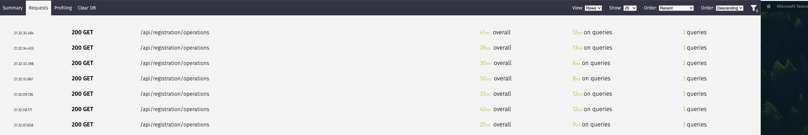
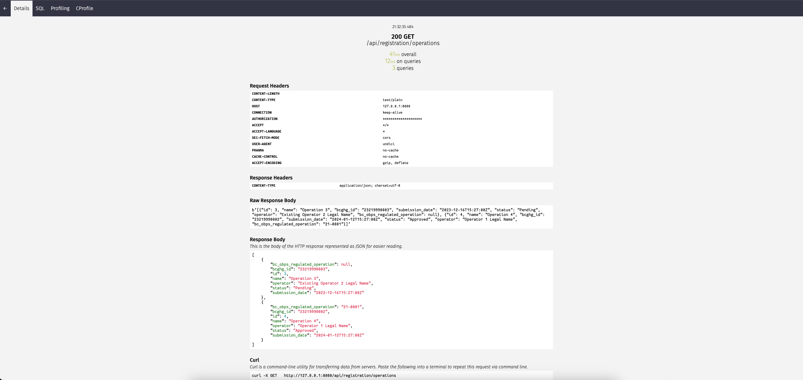
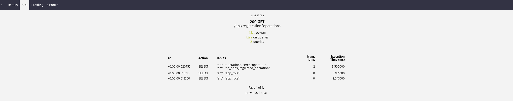

# Profiling and Optimizing Endpoints

## Django Silk

ddd
[Django Silk](https://github.com/jazzband/django-silk) is a powerful profiling tool for Django applications. It allows developers to measure and analyze the performance of their Django views, routes and middlewares. Profiling your endpoints with Django Silk can help identify bottlenecks and optimize your code for better performance.
The information provided by Silk can be immensely helpful in identifying and resolving performance issues during the development phase.

To access Django Silk's profiling reports, follow these steps:

1. Ensure Django Silk is installed and configured in your project.([Installation Guide](https://github.com/jazzband/django-silk?tab=readme-ov-file#installation))

2. Start the Django development server:

   ```bash
   make run
   ```

3. Open your web browser and navigate to `http://127.0.0.1:8000/silk/requests/` to access the Silk request profiling dashboard.

4. Trigger the endpoint you want to profile within your application.

5. Refresh the Silk dashboard to view the profiling report for the triggered endpoint and you can see overall duration, duration of SQL queries, and total number of SQL queries executed for the endpoint.

   

6. By selecting a specific request, you can view detailed information about the request and response, including time metrics, SQL queries, Request and Response details, and etc.

   

7. By selecting the SQL tab on top left, you can view the SQL queries executed for the selected request and their execution times.

   

### NOTE

Django Silk's profiler is accessible only in the local development environment.(DEBUG=True)

## Database Optimization

Optimizing database queries is crucial for improving the overall performance of a Django application. Django provides several techniques to optimize database queries and minimize the number of queries executed.

### Using `select_related`

[Django's `select_related`](https://docs.djangoproject.com/en/4.2/ref/models/querysets/#select-related) is a performance booster which results in a single more complex query but means later use of foreign-key relationships won’t require database queries.

```python
from django.db import models


class City(models.Model):
    # ...
    pass


class Person(models.Model):
    # ...
    hometown = models.ForeignKey(
        City,
        on_delete=models.SET_NULL,
        blank=True,
        null=True,
    )


class Book(models.Model):
    # ...
    author = models.ForeignKey(Person, on_delete=models.CASCADE)

# Hits the database with joins to the author and hometown tables.
b = Book.objects.select_related("author__hometown").get(id=4)
p = b.author  # Doesn't hit the database.
c = p.hometown  # Doesn't hit the database.

# Without select_related()...
b = Book.objects.get(id=4)  # Hits the database.
p = b.author  # Hits the database.
c = p.hometown  # Hits the database.

```

### Using `prefetch_related`

[Django's `prefetch_related`](https://docs.djangoproject.com/en/4.2/ref/models/querysets/#prefetch-related) serves a similar purpose to `select_related`, aiming to mitigate the issue of excessive database queries resulting from accessing related objects. However, the strategy employed by `prefetch_related` differs significantly.

```python
from django.db import models

class Author(models.Model):
    name = models.CharField(max_length=100)

class Genre(models.Model):
    name = models.CharField(max_length=50)

class Book(models.Model):
    title = models.CharField(max_length=100)
    author = models.ForeignKey(Author, on_delete=models.CASCADE)
    genres = models.ManyToManyField(Genre)
    published_at = models.DateTimeField()

class Publisher(models.Model):
    name = models.CharField(max_length=300)
    books = models.ManyToManyField(Book)

# Without prefetch_related, this hits the database with multiple queries.
publisher = Publisher.objects.get(name="BigBooks") # Hits the database.
related_books = publisher.books.all()  # Hits the database again to get the related books.

# Using prefetch_related()...
publisher = Publisher.objects.prefetch_related("books__author", "books__genres").get(name="BigBooks")
related_books = publisher.books.all()  # Doesn't hit the database for authors and genres, as they are included in the initial query.

```

### Using `.only()`

[Django's `.only()`](https://docs.djangoproject.com/en/4.2/ref/models/querysets/#only) method is a powerful tool for optimizing queries by allowing you to fetch only specific fields from the database, reducing the amount of data retrieved. This can be particularly useful when you are interested in a subset of fields and want to minimize the overhead associated with fetching unnecessary data.

Consider the following example with a Book model:

```python
from django.db import models

class Book(models.Model):
    title = models.CharField(max_length=100)
    author = models.CharField(max_length=100)
    published_at = models.DateTimeField()
    page_count = models.IntegerField()
    genre = models.CharField(max_length=50)


# Without using .only(), this fetches all fields from the database.
all_books = Book.objects.all()

# Using .only() to fetch only specific fields - title and author.
selected_fields_books = Book.objects.only('title', 'author').all()
```

This optimization becomes more noticeable when dealing with larger datasets or when only a subset of fields is required for a particular operation. By utilizing .only(), you can enhance the performance of your Django application by minimizing unnecessary data transfer from the database.

### Optimizing Django-Ninja Schema

When defining Pydantic schemas for Django-Ninja, explicitly include only the fields that are essential for processing or need to be included in the response. This minimizes the data transmitted over the network and improves the overall efficiency of your API.

In the following example, the `OperationListOut` schema is defined to include only the essential fields from the `Operation` model to be used on the client side.(Operations Table)

```python
from ninja import ModelSchema

class OperationListOut(ModelSchema):
    class Meta:
        model = Operation
        fields = ['id', 'name', 'bcghg_id', 'submission_date', 'status']
```
