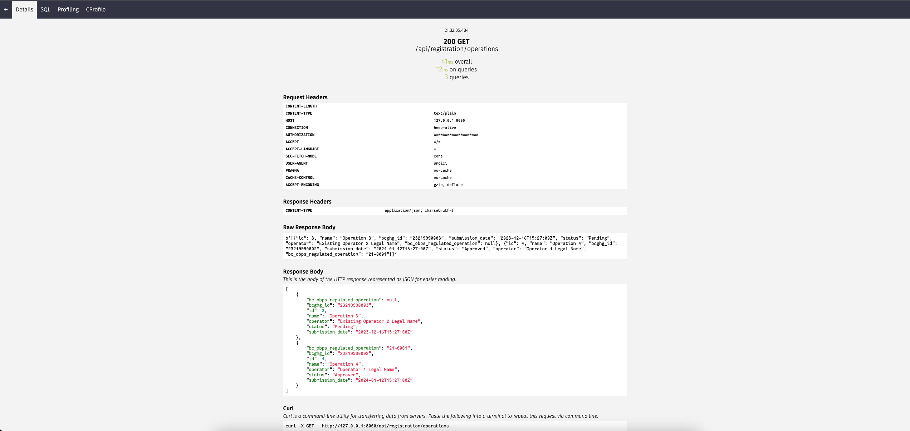
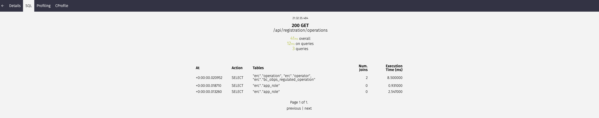

# Developer Guidelines

(For development environment setup see [`developer-environment-setup`](./developer-environment-setup))

## Next.js 14

**TLDR**

Architectural design using Next.js 14 includes employing a hierarchical structure of React server components as much as possible to enhance page loading and performance. Nested client pages are utilized whenever user interactions or event handling are required. An improved user experience is achieved through the use of layout.tsx, loading.tsx, and error.tsx components, in conjunction with Suspense components that enable the display of a fallback while asynchronous content is being loaded. The data-fetching pattern involves server actions for server side fetching security, for centralizing data access management, and for reduced API route definitions.

Next.js 14 foundation is the App Router which boasts a range of features, including:

[Routing](https://nextjs.org/docs/app/building-your-application/routing)
Creating routes involves creating folders within the app directory and nesting a page.tsx file within the appropriate folder to define your route. Note: our `withAuthorization` middleware removes the first three folders (e.g. authenticated/bceidbudiness/industry_user) from the route, so all the URLs within the app will start with `dashboard` instead of `authenticated/.../dashboard`.

[Server Components](https://nextjs.org/docs/app/building-your-application/rendering/server-components)
By default, all app router components are react server components and if you want to write a client component you need to mark them explicitly using the "use client"; directive.
We use server components, which render on the server, as much as possible to accelerate page load times as different page contents are loaded in small chunks and independently.
We use client components when ever we need user interactions or event handling such as click events and React hooks (useState, useRef).
This means Next.js can have a component hierarchy to combine server and client components.

[Layout Component](https://nextjs.org/docs/app/api-reference/file-conventions/layout)
A layout component is a versatile UI element that shapes a page's structure. It can include components like headers, footers, and sidebars, and even offer shared functions like navigation. This component is designed to receive a children prop and wrap all page files in the same directory with it.
Layout components work with routing, enabling smooth transitions between app pages. Since the layout component remains active when routes change, its state is retained, ensuring consistent and reusable layouts with minimal effort.

Nested Layouts
These are layouts defined inside folders and apply to specific route segments and render when those segments are active. It allows you to define multiple levels of layout components, each enclosing the content of its child components.

[Loading Component](https://nextjs.org/docs/app/api-reference/file-conventions/loading)
This component can be made in any app folder directory. It auto-wraps pages with a React suspense boundary (that is, a component that helps manage loading moments when components need to fetch data or resources asynchronously). It shows on the first load and during sibling route navigation.

[Error Component](https://nextjs.org/docs/app/api-reference/file-conventions/error)
This client side component confines errors to the app's tiniest section. Making an error file auto-encloses the page with a React error boundary. Any error within this file's folder swaps the component with its contents.

[Streaming](https://nextjs.org/docs/app/building-your-application/routing/loading-ui-and-streaming)
This involves sending parts of a webpage progressively from the server to the user's device. Unlike the traditional Server-Side Rendering (SSR), where all the data must be fetched before rendering, RSC streaming sends smaller chunks of HTML as they're ready.
It's works by using the <Suspense> and loading text or component, improving loading and user experience, especially on slower devices.

[Route Groups](https://nextjs.org/docs/app/building-your-application/routing/route-groups)
Route Groups organize routes in the app directory without altering URL paths. Enclosing a folder name in parentheses creates a Route Group that keeps related routes together. This allows for logical grouping, nested layouts, and a clean URL structure.

[Data Fetching](https://nextjs.org/docs/app/building-your-application/data-fetching/fetching-caching-and-revalidating)
Next.js extends the native fetch Web API to allow you to configure the caching and revalidating behavior for each fetch request on the server. React extends fetch to automatically memoize fetch requests while rendering a React component tree.

You can use fetch with:

- [React Server Components](https://nextjs.org/docs/app/building-your-application/rendering/server-components)
- [Route Handlers](https://nextjs.org/docs/app/building-your-application/routing/route-handlers)
- [Server Actions](https://nextjs.org/docs/app/api-reference/functions/server-actions)

With Server Actions, you don't need to manually create API endpoints. Instead, you define asynchronous server functions that can be called directly from Server Components or from Client Components and forms.
**Note**: Defining, or importing, a server action in a (parent) Server Component allows the (child) form `action` to function without JavaScript, providing progressive enhancement.

A single `actionHandler()` function has been created in `utils/actions` to handle all requests to the backend at a single point. This action handler takes:

- A backend endpoint
- A method (GET,PUT,POST,DELETE,PATCH)
- The path to revalidate (where was it called from on the frontend)
- An optional options object (for example, the body of a POST request goes in this object)

### NextAuth with Keycloak

NextAuth.js is a library specifically designed to handle authentication solutions in Next.js apps, see [NextAuth.js repo](https://github.com/nextauthjs/next-auth) to learn more.
NextAuth.js has a concept of providers, which define the services that can be used to sign in, in this app the provider is keycloak.

Before getting started, make sure you have a working Keycloak instance with the required configurations:

- auth-server-url
- realm
- resource
- credentials\secrets

Client/app/api/auth/[...nextauth] defines the options object for the keycloak authentication provider, session settings, JWT settings, and callbacks for sign-in, redirect, and session management. For configuration values, see [1Password](https://climateactionsecretariat.1password.ca/) documents: `OBPS FE env.local` and `OBPS FE env`

**Next.js says:**

```
Good to know: .env, .env.development, and .env.production files should be included in your repository as they define defaults. .env*.local is where secrets can be stored and should be added to .gitignore.
```

Once the NextAuth options object is configured, calls to NextAuth route `/api/auth/signin/keycloak`, triggered from `next-auth/react: signIn("keycloak")`, will direct user to the keycloak sign in form. Successful IDIR login will redirect to callback defined in NEXTAUTH_URL. Failed IDIR login will redirect to callback NEXTAUTH_URL error page (client/app/auth/error/page.tsx).

Since next-auth creates its own token, it doesn't automatically give you access to the original information from the IDIR keycloak provider.
However, the NextAuth options object provides callback functions that allow propagation of information from provider JWT to NextAuth JWT. Case in point, the keycloak JWT id_token is applied to the NextAuth JWT in JWT calback within `client/app/api/auth/[...nextauth]/route.ts` to enable federated, single sign out, through custom api route `/api/auth/logout` before ending the NextAuth session through NextAuth route `/api/auth/signout`, triggered from `next-auth/react: signOut()`.

### middleware

Next.js [Middleware ](https://nextjs.org/docs/advanced-features/middleware) allows control over requests before they are completed. Responses can be modified based on conditions such as authentication session or language detection along with implementing persistence via cookie.
Client\middleware implements middleware to secured the app routes based on NextAuth authentication JWT from the IDIR keycloak provider.

## Styling

[CSS theme guide](/docs/css-theme-guide.md)

### MUI v5

[Material-UI (MUI)](https://mui.com/material-ui/getting-started/) is a popular open-source UI framework for React applications that is based on Google's Material Design guidelines. It provides a wide range of reusable and customizable components and styles to help you build modern, attractive, and responsive web applications

Material-UI has been configured for Next.js app router using a theme registry component (/cas-registration/client/app/components/theme/ThemeRegistry.tsx) as a provider to the children within the root layout (/cas-registration/client/app/layout.tsx) and providing config option in client/next.config.js.

### Tailwind CSS

[Tailwind CSS](https://tailwindcss.com/) is a popular utility-first CSS framework that is designed to simplify and streamline the process of building modern, responsive web interfaces. It focuses on providing a set of highly reusable utility classes that you can apply directly to your HTML elements to style and structure.

Tailwind has been configured to work with MUI within client/tailwind.config.js as per [intergration documentation](https://mui.com/material-ui/guides/interoperability/#tailwind-css)

You can use Tailwind CSS classes to style Material-UI components by applying the classes directly to the Material-UI components in your JSX.

```
import { Button, Paper } from '@mui/material';

function MyComponent() {
  return (
    <Paper className="p-4">
      <Button className="bg-blue-500 hover:bg-blue-700 text-white">Click Me</Button>
    </Paper>
  );
}
```

**Optional:** It is best practice while using Tailwind and MUI together to add a prefix in the tailwind class and by setting tailwind to important so that class conflicts are reduced between these two libraries.

```js
// tailwind.config.js
module.exports = {
  prefix: 'tw-',   👈 Use your desired prefix
}
```

## Testing

### Unit Tests with Vitest

```bash
cd client && yarn test
```

If you want to see `console.log` or more detail, add the `--verbose` flag.

If you want to see more HTML output, add `DEBUG_PRINT_LIMIT=1000000` (or any large number).

If you want to access the testing playground, add `screen.logTestingPlaygroundURL()` to your test (although if the URL is too long, the playground will be blank).

Front-end unit tests include snapshots. Work that changes the DOM will result in a diff from the last accepted snapshot and cause related tests to fail. You can update the snapshots and review / accept the diff with `yarn test -u`.

#### Writing Unit Tests

React Testing Library isn't entirely compatible with Next 13 yet, so a few things to note:

- If you're testing a simple async component, you can use `render(await Operations());` instead of `render(<Operations />)`. If the component is more complicated (e.g., it imports other async components, or a mix of client/server), it appears there isn't yet a solution: https://github.com/testing-library/react-testing-library/issues/1209#issuecomment-1673372612

- To mock fetching data which uses our `actionHandler` you can import the action handler mock and mock the response values using `mockReturnValue` or `mockReturnValueOnce`:

```
import { actionHandler } from "@/tests/setup/mocks";

actionHandler.mockReturnValueOnce({
  ...mocked response data
});
```

### Backend unit tests (for API endpoints) with Pytest

#### Running Tests

The easiest way to run these tests locally is by using commands from the Makefile.

```shell
> make pythontests              # standard pytest run
> make pythontests_verbose      # run pytest with verbose output (helpful for troubleshooting unit tests)
> make pythontests_watch        # adds a watcher that can run pytest in the background; unit tests will re-run whenever changes to a Python file are detected
> make pythontests_coverage     # run pytest with coverage report
> make pythontests ARGS='registration/tests/<file_name.py>' # run pytest for a specific file
> make pythontests ARGS='-k <TestClassname>' # run pytest for a specific class, e.g. make pythontests ARGS='-k TestNaicsCodeEndpoint'
> make pythontests ARGS='-k <test_name>' # run pytest for a specific test, e.g. make pythontests ARGS='-k test_get_method_for_200_status' (note: if any tests have the same name, even if they're within different classes, this command will run them all)
```

#### Testing Helpers

We have some testing helpers in tests.utils.helpers.TestUtils:

- mock user roles for get, post, and put requests
- mock postal codes
- authorize a user as belonging to an operator
- create mock operations

To use the helpers, import them from `utils` and use like this:

```
TestUtils.mock_postal_code()
```

### End-to-end Tests with Playwright

#### Run Playwright Specs

Certainly! Below is a simple template for documentation on writing Playwright tests, including best practices and tips. Feel free to customize it based on your specific needs:

## 1.0 Ensure the server is running:

Start server from new terminal command:

# Playwright Testing Documentation

## Introduction

Playwright is a powerful end-to-end testing library for web applications. It provides a simple API to automate browser actions, allowing developers to create robust and maintainable tests.

## Getting Started

To get started with Playwright, you'll need to install it as a dependency in your project:

```bash
cd bc_obps && make run
npm install @playwright/test
```

2.0 Ensure the client app is running:

## Writing Tests

### Basic Test Structure

Playwright tests follow a simple structure. Each test case is a JavaScript or TypeScript function with Playwright APIs for interacting with the browser.

```javascript
const { test } = require("@playwright/test");
test("Example Test", async ({ page }) => {
  // Your test logic goes here
});
```

### Locators

#### Prefer User-Facing Attributes

When selecting elements, prefer using user-facing attributes over XPath or CSS selectors. This ensures that the tests are tied to the actual user experience and are less prone to breakage when the underlying structure changes.

```javascript
// Bad: Using XPath
await page.click('//div[@class="my-button"]');
// Good: Using User-Facing Attribute
await page.click('[data-testid="my-button"]');
```

#### Code Generation

To find locators, leverage Playwright's code generation feature. Use the following command to record user actions and generate test code:

```bash
cd client && npx playwright codegen http://localhost:3000
```

### Visual Comparisons

[Happo](https://happo.io/) is a cross browser screenshot testing library used to test for visual regressions. It is integrated with Playwright to capture screenshots of your application and compare them against a baseline to detect any visual changes and will upload the screenshots to the happo servers.

To view and approve Happo diffs, open a pull request with your changes and let the e2e tests run. Once the tests are complete, the Happo report will appear in the list of CI jobs. If there are differences, you can approve or reject them. If you approve them, the new screenshots will be used as the baseline for future tests once merged.

Read more about Happo and how to review diffs here:
[Reviewing Happo Diffs](https://docs.happo.io/docs/reviewing-diffs)

#### Basic setup to take Happo screenshots in your test file

```
import { test } from "@playwright/test";
import happoPlaywright from "happo-playwright";

test.beforeEach(async ({ context }) => {
  await happoPlaywright.init(context);
});

test.afterEach(async () => {
  await happoPlaywright.finish();
});

```

#### Taking a screenshot

Using html selector to take screenshot of entire page. Use something more specific if testing a component.

```
const selector = page.locator("html");

await happoPlaywright.screenshot(page, selector, {
  component: "Page",
  variant: "default",
});
```

#### Using Happo on your local e2e tests

To view diffs found while running your local e2e tests ask the dev team for access to the Happo dashboard. Add the Happo API key and secret to your .env file. The API key and secret can be found in the Happo dashboard under the Account section.

````

After you run your e2e tests the screenshots can be viewed in the Happo dashboard as snap requests.

### Best Practices

#### Test Isolation

Ensure that each test is independent and does not rely on the state or outcome of other tests. This helps in maintaining a clean and predictable test suite.

#### Use `expect` Assertions

Use `expect` assertions to verify the expected behavior of the application. Playwright includes async matchers that will wait until the expected condition is met. Consider the following example:

```javascript
await expect(page.getByTestId("status")).toHaveText("Submitted");
````

Playwright will be re-testing the element with the test id of status until the fetched element has the "Submitted" text. It will re-fetch the element and check it over and over, until the condition is met or until the timeout is reached.

### e2e Testing

#### Prerequisites

- To run playwright end-to-end tests for the first time, you may need to run `yarn playwright install --with-deps` to install the browsers
  Ensure you have the configuration from file `client/e2e/.env.local.example` in `client/e2e/.env.local` with values reflecting instructions in file `client/e2e/.env.local.example`

  1.0 Ensure the server is running:

Start server from new terminal command:

```bash
cd client && yarn dev
cd bc_obps && make run
```

2.1 Or, to simulate how the application will behave in a production environment locally, start client app from new terminal command:

```bash
cd client && yarn build && yarn start
```

Note: you can uncomment the `webServer` array in `playwright.config.ts` to run the tests without running client and server separately.

3.0 Run the tests:

Run tests from new terminal command:
Run tests in the background using terminal command:

```bash
cd client && yarn e2e
```

Run tests with the Playwright GUI using terminal command:

```bash
cd client && yarn e2e:ui
```

pre-commit run --all-files

### Debugging Playwright

**HTML report**
The HTML report shows you a report of all your tests that have been ran and on which browsers as well as how long they took. Tests can be filtered by passed tests, failed, flakey or skipped tests. You can also search for a particular test. Clicking on a test will open the detailed view where you can see more information on your tests such as the errors, the test steps and the trace.

For debugging CI, you can download the HTML report artifact found in `GitHub\Actions\Test Registration App\Artifacts\ playwright-report` and extract the files to `client/playwright-report`. To view the downloaded the HTML report artifact locally run terminal command:

```bash
cd client && yarn playwright show-report

```

[Debugging CI Playwright documentation](https://playwright.dev/docs/ci-intro#downloading-the-html-report).

**Traces**
Traces are normally run in a Continuous Integration(CI) environment, because locally you can use UI Mode for developing and debugging tests. However, if you want to run traces locally without using UI Mode, you can force tracing to be on with --trace on.

```
npx playwright test --trace on
```

**Opening the trace**
In the HTML report click on the trace icon next to the test name file name to directly open the trace for the required test, or run command:

```bash
cd client &&  npx playwright show-trace test-results/setup-trace.zip

```

### Debugging Django using Shell Plus

[Shell Plus](https://django-extensions.readthedocs.io/en/latest/shell_plus.html) is a Django extension that allows you to run a shell with all of your Django models and settings pre-loaded. This is useful for debugging and testing.
You can run Shell Plus with the following command:

```bash
> python manage.py shell_plus
```

### Sonarcloud Integration

Our project benefits from Sonarcloud integration, a static code analysis tool seamlessly integrated with Github. This integration is configured to automatically run on every pull request, identifying and reporting code issues for quick resolution. You can view the results and analysis insights on the [Sonarcloud dashboard](https://sonarcloud.io/project/overview?id=bcgov_cas-registration).

For advanced customization and configuration, we've provided a `.sonarcloud.properties` file. This file allows you to fine-tune Sonarcloud analysis settings to suit your project's unique requirements and code quality standards.

### Entity-Relationship Diagram (ERD) Generation

We use [Mermaid](https://mermaid-js.github.io/mermaid/) to create ERD diagrams for our data models. The [django-diagram](https://github.com/nick-solly/django-diagram) package enables the generation of ERD diagrams specific to our Django models.

To generate the most recent ERD diagram, navigate to the `bc_obps` directory (where the `manage.py` file is located) and execute the following command in your terminal:

```bash
poetry run python -m django_diagram --app=registration --output=../erd.md --settings=bc_obps.settings

```

### Audit Trail Implementation

Within our Django application, we employ the `TimeStampedModel` abstract data model to integrate audit columns into our various models. This model resides in `bc_obps/registration/models.py` and serves as the foundation for all data models requiring audit trails. It incorporates the following columns:

`created_at`: Captures the timestamp when an object is initially created.
`created_by`: Records the creator of the object.
`updated_at`: Indicates the timestamp of the object's last update.
`updated_by`: Stores the user who last modified the object.
`archived_at`: Documents the timestamp when an object is archived.
`archived_by`: Registers the user who initiated the archiving process.

This data model is equipped with two essential methods:

`set_create_or_update`: This method sets the necessary audit columns when creating a new object or updating an existing one. It requires the user initiating the modification as a parameter.

`set_archive`: Specifically designed for archiving objects, this method captures the archival details and requires the user initiating the archival process as a parameter.

Furthermore, a custom manager is implemented to filter out archived objects, ensuring a streamlined retrieval process focused only on active data.

## Profiling and Optimizing Endpoints

### Django Silk

[Django Silk](https://github.com/jazzband/django-silk) is a powerful profiling tool for Django applications. It allows developers to measure and analyze the performance of their Django views, routes and middlewares. Profiling your endpoints with Django Silk can help identify bottlenecks and optimize your code for better performance.
The information provided by Silk can be immensely helpful in identifying and resolving performance issues during the development phase.

To access Django Silk's profiling reports, follow these steps:

1. Ensure Django Silk is installed and configured in your project.([Installation Guide](https://github.com/jazzband/django-silk?tab=readme-ov-file#installation))

2. Start the Django development server:

   ```bash
   make run
   ```

3. Open your web browser and navigate to `http://127.0.0.1:8000/silk/requests/` to access the Silk request profiling dashboard.

4. Trigger the endpoint you want to profile within your application.

5. Refresh the Silk dashboard to view the profiling report for the triggered endpoint and you can see overall duration, duration of SQL queries, and total number of SQL queries executed for the endpoint.

   

6. By selecting a specific request, you can view detailed information about the request and response, including time metrics, SQL queries, Request and Response details, and etc.

   

7. By selecting the SQL tab on top left, you can view the SQL queries executed for the selected request and their execution times.

   

#### NOTE

Django Silk's profiler is accessible only in the local development environment.(DEBUG=True)

## Database Optimization

Optimizing database queries is crucial for improving the overall performance of a Django application. Django provides several techniques to optimize database queries and minimize the number of queries executed.

### Using `select_related`

[Django's `select_related`](https://docs.djangoproject.com/en/4.2/ref/models/querysets/#select-related) is a performance booster which results in a single more complex query but means later use of foreign-key relationships won’t require database queries.

```python
from django.db import models


class City(models.Model):
    # ...
    pass


class Person(models.Model):
    # ...
    hometown = models.ForeignKey(
        City,
        on_delete=models.SET_NULL,
        blank=True,
        null=True,
    )


class Book(models.Model):
    # ...
    author = models.ForeignKey(Person, on_delete=models.CASCADE)

# Hits the database with joins to the author and hometown tables.
b = Book.objects.select_related("author__hometown").get(id=4)
p = b.author  # Doesn't hit the database.
c = p.hometown  # Doesn't hit the database.

# Without select_related()...
b = Book.objects.get(id=4)  # Hits the database.
p = b.author  # Hits the database.
c = p.hometown  # Hits the database.

```

### Using `prefetch_related`

[Django's `prefetch_related`](https://docs.djangoproject.com/en/4.2/ref/models/querysets/#prefetch-related) serves a similar purpose to `select_related`, aiming to mitigate the issue of excessive database queries resulting from accessing related objects. However, the strategy employed by `prefetch_related` differs significantly.

```python
from django.db import models

class Author(models.Model):
    name = models.CharField(max_length=100)

class Genre(models.Model):
    name = models.CharField(max_length=50)

class Book(models.Model):
    title = models.CharField(max_length=100)
    author = models.ForeignKey(Author, on_delete=models.CASCADE)
    genres = models.ManyToManyField(Genre)
    published_at = models.DateTimeField()

class Publisher(models.Model):
    name = models.CharField(max_length=300)
    books = models.ManyToManyField(Book)

# Without prefetch_related, this hits the database with multiple queries.
publisher = Publisher.objects.get(name="BigBooks") # Hits the database.
related_books = publisher.books.all()  # Hits the database again to get the related books.

# Using prefetch_related()...
publisher = Publisher.objects.prefetch_related("books__author", "books__genres").get(name="BigBooks")
related_books = publisher.books.all()  # Doesn't hit the database for authors and genres, as they are included in the initial query.

```

### Using `.only()`

[Django's `.only()`](https://docs.djangoproject.com/en/4.2/ref/models/querysets/#only) method is a powerful tool for optimizing queries by allowing you to fetch only specific fields from the database, reducing the amount of data retrieved. This can be particularly useful when you are interested in a subset of fields and want to minimize the overhead associated with fetching unnecessary data.

Consider the following example with a Book model:

```python
from django.db import models

class Book(models.Model):
    title = models.CharField(max_length=100)
    author = models.CharField(max_length=100)
    published_at = models.DateTimeField()
    page_count = models.IntegerField()
    genre = models.CharField(max_length=50)


# Without using .only(), this fetches all fields from the database.
all_books = Book.objects.all()

# Using .only() to fetch only specific fields - title and author.
selected_fields_books = Book.objects.only('title', 'author').all()
```

This optimization becomes more noticeable when dealing with larger datasets or when only a subset of fields is required for a particular operation. By utilizing .only(), you can enhance the performance of your Django application by minimizing unnecessary data transfer from the database.

### Optimizing Django-Ninja Schema

When defining Pydantic schemas for Django-Ninja, explicitly include only the fields that are essential for processing or need to be included in the response. Avoid adding unnecessary fields to minimize the data transmitted over the network and improve the overall efficiency of your API.

In the following example, the `OperationListOut` schema is defined to include only the essential fields from the `Operation` model to be used on the client side.(Operations Table)

```python
from ninja import ModelSchema

class OperationListOut(ModelSchema):
    operator: str = Field(..., alias="operator.legal_name")
    bc_obps_regulated_operation: Optional[str] = Field(None, alias="bc_obps_regulated_operation.id")

    class Config:
        model = Operation
        model_fields = ['id', 'name', 'bcghg_id', 'submission_date', 'status']
```

## Common Utils

### `custom_reverse_lazy` Function

This utility function facilitates flexible URL reversal in Django by allowing the reverse of a URL. It's particularly useful for dynamic parameter URLs and avoids hardcoding. Additionally, it leverages the `url_name` defined on each API endpoint for URL reversal, ensuring consistency.

For example, to reverse the URL for the `get_operation` API endpoint with a dynamic parameter `operation_id`:

```python
custom_reverse_lazy("get_operation", kwargs={"operation_id": operation_instance_1.id})
```

This will return the URL for the `get_operation` endpoint with the `operation_id` parameter.

## API Design

The goal of API design is to separate concerns as much as possible.

### Endpoints

Endpoints are app-specific (e.g. `registration/api/select-operator/request-access`) and should contain as little logic as possible. They should only:

- handle role-based authorization using the @authorize decorator
- handle http errors using the @handle_http_errors decorator (placed below @authorize or else it will catch auth errors)
- send http responses
- use services

For example:

```
@router.post(
    "/select-operator/request-access",
    response={201: RequestAccessOut, custom_codes_4xx: Message},
    url_name="request_access",
)
@authorize(["industry_user"], UserOperator.get_all_industry_user_operator_roles(), False)
@handle_http_errors()
def request_access(request, payload: SelectOperatorIn):

    return 201, ApplicationAccessService.request_access(payload.operator_id, get_current_user_guid(request))
```

### Services

Services are not app-specific and can be used by any BCIERS app. We have the following categories of services:

### Database access services

The only things these services do are:

- access the database (query, create, etc.)
- ensure transactions are atomic using the @transaction.atomic() decorator when required (not needed for GET)
- set audit columns
- return exceptions (rarely; usually we allow the default django error to be caught and handled in the endpoint by the @handle_http_errors decorator)

For example:

```
@transaction.atomic()
    def get_or_create_user_operator(user_guid: UUID, operator_id: UUID):
        "Function to create a user_operator"
        user = UserDataAccessService.get_user_by_guid(user_guid)
        operator = OperatorDataAccessService.get_operator_by_id(operator_id)
        user_operator, created = UserOperator.objects.get_or_create(
            user=user, operator=operator, status=UserOperator.Statuses.PENDING, role=UserOperator.Roles.PENDING
        )
        if created:
            user_operator.set_create_or_update(user.pk)
        return user_operator
```

### Intermediary services

Sometimes, an endpoint needs to do something more complicated than simply call a database access service and return data. In these cases, we create custom services. For example, in the registration app, when a brand-new operator wants to request access, we need to create operator and user_operator records at the same time. These intermediary services do some or all the following things, depending on the business logic required:

- if multiple database services are called, ensure they're atomic using the @transaction.atomic() decorator
- check if users should be allowed to do things (in the regisration app, role-based authentication is handled in the endpoints, but anything more specific (e.g., if an operator already has an admin, subsequent users can't request admin access) is handled in an intermediary service)
