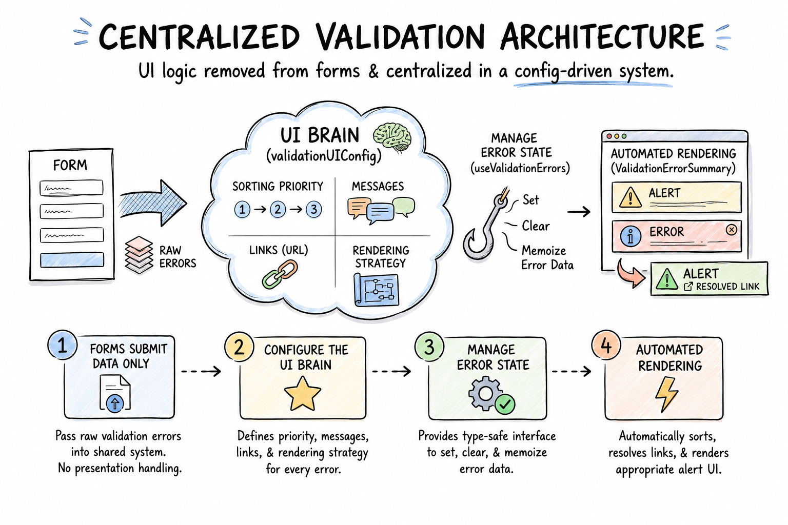

# Validation Error System Architecture

The validation error system uses a **configuration-driven frontend architecture** to provide consistent error handling, sorting, messaging, linking, and rendering across forms.

Forms only need to submit requests or perform client-side pre-submit checks, and pass validation errors into the shared system. Presentation behavior is centralized in domain-specific `validationUIConfig` definitions and the shared `ValidationErrorSummary` component.

```
Form Submission / User Action / Client Guard
      │
      ├───────────────────────────────┐
      ▼                               ▼
actionHandler / async API call   Client-Side Guard Check
Handles request / normalizes          │
      │                               ▼
      ▼                         setClientError
handleApiResponse          Sets generic error & returns false
Evaluates status & errors             │
      │                               │
      └──────────────┬────────────────┘
                     │
                     ▼
            useValidationErrors
       Manages error state & memoizes summary
                     │
                     ├──── Domain-Specific validationUIConfig (optional)
                     │     (e.g., reporting, compliance, registration)
                     │     priority
                     │     message / label
                     │     getHref
                     │     renderMode
                     ▼
            ValidationErrorSummary
       Sorts and renders errors via AlertNote
                     │
                     ▼
                  Form UI

```

---

## Core Components & Types

### `types.ts` & Base Definitions

All base types and interfaces are exported from the shared package `@bciers/components/validationErrors`:

```ts
export type ValidationSeverity = "Error" | "Warning" | "Info";

export type ValidationRenderMode = "message_only" | "inline_link";

export interface ValidationItemError {
  severity: ValidationSeverity;
  message?: string;
  context?: Record<string, unknown>;
}

export interface ValidationItem<TKey extends string = string> {
  key: TKey;
  error: ValidationItemError;
}

export type ValidationErrors<TKey extends string = string> =
  ValidationItem<TKey>[];
```

---

## Helpers: Pure Factories vs. Dispatchers

The package distinguishes between **pure data builders** (factories) and **state dispatchers**:

### 1. `createGenericValidationError` (Pure Factory)

Creates a standardized `ValidationItem` object with zero side effects. Use it when mapping arrays of error strings, data transformations, or unit test assertions.

```
export const createGenericValidationError = <TKey extends string = string>(
  message: string,
  severity: ValidationSeverity = "Error",
): ValidationItem<TKey> => ({
  key: "generic_error" as TKey,
  error: {
    message,
    severity,
  },
});
```

### 2. `setClientError` (State Dispatcher)

Sets a client-side validation error directly into state and returns `false`. This is ideal for one-line client-side guard clauses before triggering an API call.

```
export const setClientError = <TKey extends string = string>(
  message: string,
  setErrors: (errors: ValidationItem<TKey>[] | undefined) => void,
  severity: ValidationSeverity = "Error",
): boolean => {
  setErrors([createGenericValidationError<TKey>(message, severity)]);
  return false;
};
```

#### Usage Example: Client-Side Pre-Submit Guard

```
const onSubmit = async (data: { formData?: OperationFormData }) => {
  setErrors(undefined);

  // Client-side business rule guard
  if (!data.formData?.product_selection?.includes("Pulp and paper: chemical pulp")) {
    return setClientError(
      "Missing Product: 'Pulp and paper: chemical pulp'. Please add the product on the operation review page.",
      setErrors,
    );
  }

  const response = await actionHandler("registration/operations", "POST", ...);

      const isSuccess = handleApiResponse(response, setErrors);
      if (!isSuccess) return;

  router.push("/operations");
};

```

---

## Domain-Specific `validationUIConfig`

Each domain (such as `administration`, `compliance`, `registration`, or `reporting`) can define its own `validationUIConfig` tailored to its distinct validation keys, business routes, and messages.

Domain configurations use the shared helper `createValidationUIConfig` from `@bciers/components/validationErrors` along with domain-scoped `ValidationMessageKey` unions:

```ts
// src/app/components/validationErrors/config.ts (Domain-Specific)
import { createValidationUIConfig } from "@bciers/components/validationErrors";
import { ValidationMessageKey } from "./types";

export const validationUIConfig: Record<
  ValidationMessageKey,
  ReturnType<typeof createValidationUIConfig>
> = {
  no_bceid_access: {
    priority: 10,
    renderMode: "inline_link",
    resolveLabel: () => "ghgregulator@gov.bc.ca",
    resolveHref: () => ghgRegulatorEmail,
    resolveMessage: (error) =>
      error.message ??
      "Your business BCeID does not have access to this operator. Please contact ghgregulator@gov.bc.ca",
    resolveFormattedMessage: (error) =>
      error.message ??
      "Your business BCeID does not have access to this operator. Please contact ghgregulator@gov.bc.ca",
  },
};
```

Configuration can define:

- **Sorting priority:** Lower numbers render first.
- **Message / Label:** Dynamic resolution from `error.context` or string constants.
- **Deep Links (`getHref`):** Context-aware domain URLs for navigation jumps.
- **Rendering strategy (`renderMode`):** `message_only`, `label_then_message`, or `inline_link`.

---

## Hook API: `useValidationErrors`

Provides the standard hook interface components use to manage validation errors.

```ts
// 1. Unconfigured / Generic Mode (Uses default fallback):
const { setErrors, renderedErrors } = useValidationErrors();

// 2. Domain-Configured / Type-Safe Mode:
const { setErrors, renderedErrors } = useValidationErrors({
  config: validationUIConfig, // Domain config imported from local feature folder
});
```

- **`setErrors`** — Sets or clears validation errors (`setErrors(undefined)` clears errors).
- **`renderedErrors`** — Memoized `ValidationErrorSummary` element ready to insert directly into JSX.
- **`config`** — Provides domain-specific presentation rules.
- **`ValidationMessageKey`** — Domain union restricting error keys to strictly defined feature values.

### Comparing Error Handling Mechanisms

| Mechanism                          | Purpose                                       | Input                           | Side Effects                            | Returns                                              |
| ---------------------------------- | --------------------------------------------- | ------------------------------- | --------------------------------------- | ---------------------------------------------------- |
| **`handleApiResponse`**            | Evaluates async API / server action responses | `response, setErrors`           | Updates `setErrors` if invalid          | `boolean` (`true` if valid, `false` if errors exist) |
| **`setClientError`**               | Pre-submit client validation guards           | `message, setErrors, severity?` | Dispatches generic error to `setErrors` | `false` (for early return)                           |
| **`createGenericValidationError`** | Factory for pure validation objects           | `message, severity?`            | None                                    | `ValidationItem`                                     |

---

## `ValidationErrorSummary`

Handles the presentation of validation errors:

1. Filters out empty and inactive errors.
2. Sorts errors by severity (`Error` > `Warning` > `Info`) and configured `priority`.
3. Looks up the domain UI configuration for each error (falling back to `defaultGenericErrorConfig` for unmapped keys).
4. Resolves messages, labels, and links.
5. Renders the appropriate `AlertNote`.

---

## Implementation Flow

```text
Component / Form
 │
 ├── Client Guard Check ──────► setClientError(message, setErrors) ──┐
 │                                                                   │
 └── Server Action Call ──────► handleApiResponse(res, setErrors)
                                                                     │
                                                                     ▼
                                                             setErrors(...)
                                                                     │
                                                                     ▼
                                                            useValidationErrors
                                                                     │
                                 ┌───────────────────────────────────┤
                                 ▼                                   ▼
                   Local Domain validationUIConfig      Fallback defaultGenericErrorConfig
                                 │                                   │
                                 └─────────────────┬─────────────────┘
                                                   │
                                                   ▼
                                        ValidationErrorSummary
                                                   │
                                      ├── Sorts by Severity & Priority
                                      └── Resolves Dynamic Labels & Links
                                                   │
                                                   ▼
                                           Rendered AlertNote(s)

```

---

## Architectural Principle

Forms and action components should not contain validation-specific presentation logic or hardcoded error parsing.

```text
Form / Action Component
  → Execute client validation guard (via setClientError) or dispatch server action
  → Pass response payload to handleApiResponse
  → Render renderedErrors inline in JSX

Domain Configuration
  → Define business error keys and dynamic links per feature module
  → Map domain rules via createValidationUIConfig

Shared Validation System
  → Maintain reactive error state
  → Determine severity and priority ordering
  → Resolve dynamic messages, field labels, and links
  → Render accessible AlertNote banners

```

---



#### Image Generation details

- **Tool:** ChatGPT (OpenAI), including AI image generation
- **Input:** Technical information contained in this document

> [!NOTE]
> AI-generated diagrams are for explanatory purposes only. If a diagram conflicts with the application code, technical documentation, or applicable regulations, those sources take precedence.
