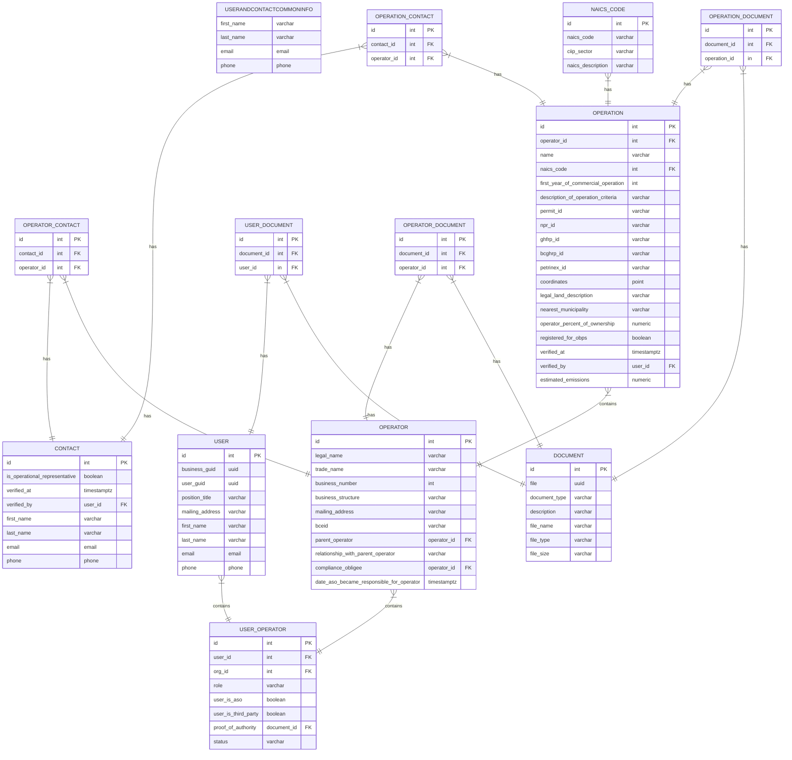

To view this Entity Relationship Diagram, copy-paste the code below into the [Mermaid Live Editor](https://mermaid.live/edit), or install the Markdown Preview Mermaid VS Code extension.

What are these/what table should they be associated with?

- statuatory declaration
- percentage ownership (can operations be part of more than one operator?)
- Commitment to meet compliance obligation
- Amount of operations (operations registration needed)
- Main contact user

Considerations/questions

- there could be more than one ASO?
- operation vs. operator in provided doc
- unsure about what documents were meant to be associated with; might have too many doc tables

this is probably more for reporting:
PRODUCT |{--|| OPERATION : produces
PRODUCT {
id int PK
operation_id int FK
name varchar
first_production_date timestamptz
}
