To view this Entity Relationship Diagram, copy-paste the code below into the [Mermaid Live Editor](https://mermaid.live/edit), or install the Markdown Preview Mermaid VS Code extension.

NOTE: Facilities may not be included in MVP

Roles can be:

- senior_officer
- operation_representative
- authorized_signing_officer
- operation_registration_lead

Document types can be:

- boundary_map
- signed_statuatory_declaration
- process_flow_diagram
- proof_of_authority_of_partner_company
- senior_officer_proof_of_authority
- operation_representative_proof_of_authority
- soce_senior_officer_proof_of_authority
- proof_of_start
- opt_in_signed_statuatory_declaration

Questions

- where are we at with facilities
- is the statuatory declaration a user document? YES
- naics code table correct?
- naics category needs to be a table, or we can get from code, or?
- what to do if parent company not in system? how would we present them with a list to choose from? if it's free form entry we'll get a lot of duplicate entries. DISPLAY DROPDOWN, ADD PARENT
- is this importantly 2022 or just last year/next year. What happens in 2027? PREVOIUS/CURRENT
- do the roles (SO, ASO, etc.) mean the same thing always, regardless of whether it's for the operation, operator? YES?

```mermaid
erDiagram

    USERANDCONTACTCOMMONINFO {
        first_name varchar
        last_name varchar
        position_title varchar
        street_address varchar
        municipality varchar
        province varchar
        postal_code varchar
        email email
        phone phone
    }

    USER {
        business_guid uuid
        user_guid uuid

        first_name varchar
        last_name varchar
        position_title varchar
        mailing_address varchar
        municipality varchar
        province varchar
        postal_code varchar
        email email
        phone phone
    }

    CONTACT {
        id int PK
        role role_id FK

        first_name varchar
        last_name varchar
        position_title varchar
        mailing_address varchar
        municipality varchar
        province varchar
        postal_code varchar
        email email
        phone phone
    }

    OPERATOR_CONTACT {
        id int PK
        contact_id int FK
        operator_id int FK
        role role_id FK
    }

    OPERATION_CONTACT {
        id int PK
        contact_id int FK
        operator_id int FK
        role role_id FK
    }

    ROLE {
        id int PK
        name varchar
    }

    OPERATOR {
        id int PK
        legal_name varchar
        trade_name varchar
        cra_business_number int
        bc_corporate_registry_number int
        business_structure varchar
        physical_address varchar
        physical_address_municipality varchar
        physical_address_province varchar
        physical_address_postal_code varchar
        mailing_address varchar
        mailing_address_municipality varchar
        mailing_address_province varchar
        mailing_address_postal_code varchar
        website varchar

    }

    PARENT_CHILD_OPERATOR {
        id int FK
        parent_operator operator_id FK
        child_operator operator_id FK
        percentage_owned_by_parent_company number
    }


    USER_OPERATOR {
         id int PK
         user_id int FK
         operator_id int FK
         role varchar
         status varchar
         verified_at timestamptz
         verified_by user_id FK
    }

    OPERATIONANDFACILITYCOMMONINFO {
        name varchar
        type varchar
        naics_code naics_code_id FK
        naics_category naics_category_id FK
        reporting_activities varchar
        permit_issuing_agency varchar
        permit_number varchar
        attributable_emissions_2022 number
        swrs_facility_id number
        bcghg_id number
        estimated_emissions_2023 number
        opt_in boolean
        new_entrant boolean
        start_of_commercial_operation timestamptz
        physical_address varchar
        municipality varchar
        province varchar
        postal_code varchar
        legal_land_description varchar
        latitude number
        longitude number
        npri_id number
        bcer_permit_id number
    }

    PETRINEX_ID {
        id varchar PK

    }

    OPERATION_PETRINEX_ID {
        id int PK
        petrinex_id int FK
        operator_id int FK
    }

    FACILITY_PETRINEX_ID {
        id int PK
        petrinex_id int FK
        facility_id int FK
    }

    OPERATION {
        id int PK
        operator operator_id FK
        major_new_operation boolean
        verified_at timestamptz
        verified_by user_id FK
        status string

        name varchar
        type varchar
        naics_code naics_code_id FK
        naics_category naics_category_id FK
        reporting_activities varchar
        permit_issuing_agency varchar
        permit_number varchar
        attributable_emissions_2022 number
        swrs_facility_id number
        bcghg_id number
        estimated_emissions_2023 number
        opt_in boolean
        new_entrant boolean
        start_of_commercial_operation timestamptz
        physical_address varchar
        municipality varchar
        province varchar
        postal_code varchar
        legal_land_description varchar
        latitude number
        longitude number
        npri_id number
        bcer_permit_id number
    }

    OPERATOR_OPERATION {
        id int PK
        operator_id int FK
        operation_id int FK
    }

    FACILITY {
        id int PK
        operation_id int FK

        name varchar
        type varchar
        naics_code naics_code_id FK
        naics_category naics_category_id FK
        reporting_activities varchar
        permit_issuing_agency varchar
        permit_number varchar
        attributable_emissions_2022 number
        swrs_facility_id number
        bcghg_id number
        estimated_emissions_2023 number
        opt_in boolean
        new_entrant boolean
        start_of_commercial_operation timestamptz
        physical_address varchar
        municipality varchar
        province varchar
        postal_code varchar
        legal_land_description varchar
        latitude number
        longitude number
        npri_id number
        bcer_permit_id number
    }


    NAICS_CODE {
        id int PK
        naics_code varchar
        ciip_sector varchar
        naics_description varchar
    }

    NAICS_CATEGORY {
        id int PK
        naics_category varchar
    }

    REGULATED_PRODUCT {
        id int PK
        name varchar
    }

    OPERATION_REGULATED_PRODUCT  {
        id int PK
        product_id int FK
        operation_id int FK
    }

    FACILITY_REGULATED_PRODUCT {
        id int PK
        product_id int FK
        facility_id int FK
    }

    DOCUMENT {
        id int PK
        file file
        document_type document_type_id FK
        description varchar

    }


    DOCUMENT_TYPE {
        id int PK
        name varchar
    }

    USER_DOCUMENT {
        id int PK
        document_id int FK
        user_id in FK
    }
    OPERATION_DOCUMENT {
        id int PK
        document_id int FK
        operation_id in FK
    }
    OPERATOR_DOCUMENT {
        id int PK
        document_id int FK
        operator_id int FK
    }
    FACILITY_DOCUMENT {
        id int PK
        document_id int FK
        facility_id int FK
    }

    USER |{--|| USER_OPERATOR : contains
    OPERATOR |{--|| USER_OPERATOR : contains
    OPERATOR_OPERATION |{--|| OPERATOR : has
    OPERATOR_OPERATION |{--|| OPERATION : has
    PARENT_CHILD_OPERATOR |{--|| OPERATOR : has
    OPERATION_PETRINEX_ID |{--|| OPERATION : has
    OPERATION_PETRINEX_ID |{--|| PETRINEX_ID : has
    FACILITY |{--|| OPERATION : contains
    FACILITY_PETRINEX_ID |{--|| FACILITY : has
    FACILITY_PETRINEX_ID |{--|| PETRINEX_ID : has
    OPERATION_REGULATED_PRODUCT |{--|| OPERATION : has
    OPERATION_REGULATED_PRODUCT |{--|| REGULATED_PRODUCT : has
    FACILITY_REGULATED_PRODUCT |{--|| FACILITY : has
    FACILITY_REGULATED_PRODUCT |{--|| REGULATED_PRODUCT : has
    DOCUMENT_TYPE |{--|| DOCUMENT : has
    USER_DOCUMENT |{--|| USER : has
    USER_DOCUMENT |{--|| DOCUMENT : has
    OPERATION_DOCUMENT |{--|| OPERATION : has
    OPERATION_DOCUMENT |{--|| DOCUMENT : has
    OPERATOR_DOCUMENT |{--|| OPERATOR : has
    OPERATOR_DOCUMENT |{--|| DOCUMENT : has
    FACILITY_DOCUMENT |{--|| FACILITY : has
    FACILITY_DOCUMENT |{--|| DOCUMENT : has
    OPERATOR_CONTACT |{--|| CONTACT : has
    OPERATION_CONTACT |{--|| CONTACT : has
    OPERATION_CONTACT |{--|| OPERATION : has
    OPERATOR_CONTACT |{--|| OPERATOR : has
    ROLE |{--|| OPERATOR_CONTACT : has
    ROLE |{--|| OPERATION_CONTACT : has
    NAICS_CODE |{--|| OPERATION : has
    NAICS_CATEGORY |{--|| OPERATION : has
    NAICS_CODE |{--|| FACILITY : has
    NAICS_CATEGORY |{--|| FACILITY : has



```

